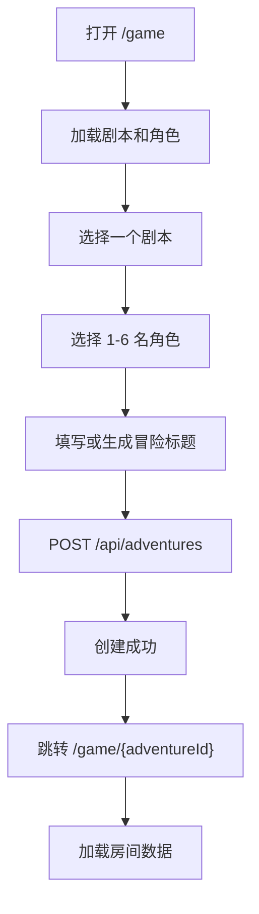
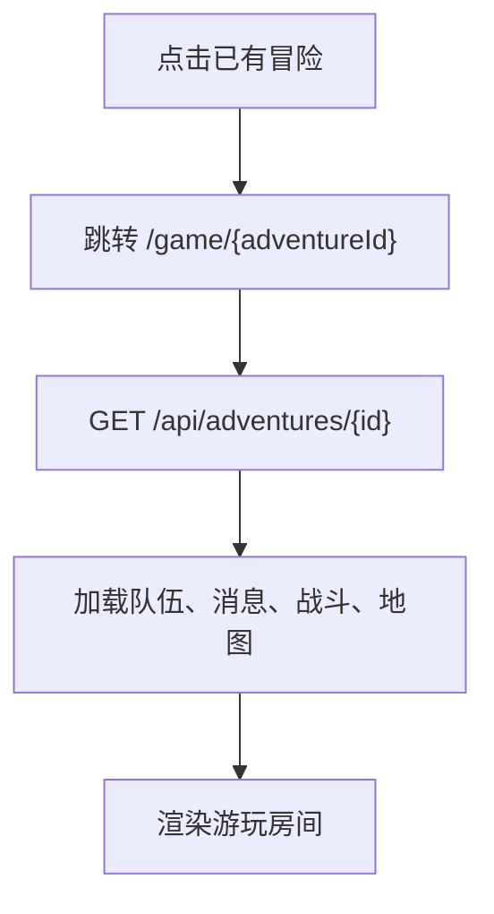

# 游戏开局与房间前端设计

## 一、目标

本设计用于把当前 `/game` 的三栏混合页面拆成两个明确阶段：

1. `/game`：开局准备页。玩家选择剧本和一支角色队伍，然后创建一局冒险。
2. `/game/{adventureId}`：游玩房间页。冒险创建后进入固定房间，剧本和队伍在本局中锁定，玩家通过地图、战斗工具和 DM Agent 聊天推进游戏。

静态参考稿位于：

`.superpowers/brainstorm/room-layout-20260617/content/game-start-and-room-static.html`

## 二、核心规则

1. 一局游戏允许选择 1 到 6 名玩家角色。
2. 推荐队伍人数为 2 到 4 名；超过 4 名时前端提示“队伍人数较多，战斗回合会变长”。
3. NPC、敌人、召唤物、临时 token 不计入玩家角色数量限制。
4. 冒险创建后，剧本和队伍不可在该房间中修改。
5. 如果玩家想换角色或调整队伍，需要回到 `/game` 创建一局新的冒险。
6. 游玩房间中的左侧角色区展示“当前行动角色”和“本局队伍”，不是重新选择角色入口。

## 三、路由设计

### `/game`

开局准备页，负责：

1. 加载剧本列表。
2. 加载已创建角色列表。
3. 支持多选队伍角色。
4. 展示创建前摘要。
5. 展示已有冒险列表。
6. 创建冒险成功后跳转到 `/game/{adventureId}`。

### `/game/{adventureId}`

游玩房间页，负责：

1. 加载指定冒险。
2. 加载冒险绑定的剧本快照和队伍角色。
3. 加载当前场景、消息、战斗状态、地图场景和 token。
4. 固定展示本局队伍，不允许切换角色。
5. 根据当前战斗回合启用或禁用玩家动作按钮。

### 前端路由实现

当前 `frontend/static/js/ui.js` 只支持静态路由映射。需要增加动态路由解析：

```text
/game                  -> game setup mode
/game/{adventureId}    -> game room mode
```

建议保留 `state.view = "game"`，再增加：

```text
state.gameMode = "setup" | "room"
state.selectedAdventureId = number | null
```

`viewFromPath()` 需要识别 `/game/123` 并返回 `game`，同时把 `123` 交给初始化流程加载冒险。

## 四、前端状态设计

在 `frontend/static/js/state.js` 中新增或调整：

```text
selectedPartyCharacterIds: number[]
selectedAdventureId: number | null
selectedAdventure: AdventureOut | null
gameMode: "setup" | "room"
currentRoomCharacterId: number | null
```

状态含义：

1. `selectedPartyCharacterIds`：开局准备页中已勾选的角色 ID。
2. `selectedAdventureId`：当前选中的冒险 ID。
3. `selectedAdventure`：当前房间完整冒险数据。
4. `gameMode`：决定 `/game` 页面渲染准备页还是房间页。
5. `currentRoomCharacterId`：房间内当前行动或当前查看的队伍成员。战斗中优先由 `combat.turn_index` 推导。

派生数据：

```text
partyCharacters = characters.filter(character.id in selectedAdventure.party_character_ids)
currentCombatant = combat.participants[combat.turn_index]
currentActionCharacter = partyCharacters.find(name/id matches currentCombatant)
```

## 五、开局准备页设计

### 页面布局

开局准备页采用左右布局：

1. 左侧主区域：
   - 剧本选择。
   - 队伍角色多选。
2. 右侧摘要区：
   - 已选剧本。
   - 已选队伍。
   - 冒险标题。
   - 创建按钮。
   - 已有冒险列表。

### 剧本选择

剧本卡片只展示选择所需信息，不展示默认剧本长文本内容：

1. 剧本标题。
2. 简短描述。
3. 等级、地点、风格标签。
4. 选中状态。

如果没有剧本，显示空状态并引导进入 `/stories` 创建剧本。

### 队伍角色选择

角色卡片支持多选：

1. 点击卡片切换选中状态。
2. 已选角色显示“已加入队伍”。
3. 未选角色显示“未加入”。
4. 已选数量为 0 时禁用创建按钮。
5. 已选数量超过 6 时阻止继续选择并提示。
6. 已选数量超过 4 且不超过 6 时允许创建，但显示提醒。

角色卡片展示：

1. 角色名。
2. 种族、职业、等级、背景。
3. HP、AC。
4. 创建校验状态。

### 创建按钮状态

创建按钮启用条件：

1. 已选择剧本。
2. 已选择 1 到 6 名角色。
3. 冒险标题不为空。
4. 当前没有提交中的创建请求。

错误提示统一使用 i18n 文案，不在 JS 中写死中文或英文。

## 六、游玩房间页设计

### 总体布局

游玩房间页使用三列加底部工具布局：

1. 顶部状态栏：
   - 冒险标题。
   - 当前场景。
   - 当前轮次和当前行动角色。
   - 绑定剧本。
   - 绑定队伍。
2. 左侧工具栏：
   - 当前行动角色卡。
   - 本局队伍成员列表。
   - 玩家回合动作按钮。
   - 战斗状态列表。
   - 投掷骰子模块。
3. 中央地图舞台：
   - 当前 active map scene。
   - 网格、token、测距、图层入口。
   - 地图必须是页面视觉中心。
4. 右侧 DM Agent 聊天：
   - DM 叙事。
   - 玩家输入。
   - NPC 行动结果。
   - 规则裁决解释。
5. 底部工具栏：
   - 规则检索。
   - 地图库或场景管理抽屉入口。
   - 其他低频工具入口。

### 左侧角色与战斗

左侧不再提供“切换本局角色”的创建级操作，只提供房间内视角和战斗动作：

1. `当前行动角色`：显示当前回合的玩家角色。
2. `本局队伍`：显示所有绑定角色，标记当前回合、待行动、倒地、死亡等状态。
3. `动作按钮`：只在当前 combatant 属于玩家队伍且可行动时启用。
4. HP 为 0、`defeated = true`、`incapacitated` 等状态下禁止攻击、疾走、回避等动作。

### 左侧骰子模块

保留当前前端已有的投掷骰子模块，不重新设计为新系统。

放置位置：

1. 位于左侧工具栏中。
2. 放在“战斗状态”模块下方。
3. 保留现有 d4、d6、d8、d10、d12、d20 按钮。
4. 保留现有投掷结果展示和历史记录。
5. 仅调整布局位置和响应式尺寸，不改变当前投掷逻辑。

原因：

1. 骰子属于高频战斗/检定工具，和当前行动角色、战斗状态放在一起更符合操作流。
2. 右侧需要保留给 DM Agent 聊天。
3. 底部工具栏应留给低频入口，例如规则检索、地图库、场景管理。

### 中央地图

当前右侧详情栏中的 `map-preview` 需要升级为房间页主舞台：

1. 地图从详情面板移到中央主区域。
2. 地图大小使用稳定比例和最大宽度，避免窗口变化导致布局跳动。
3. token 显示角色或 NPC 的本地化缩写。
4. 当前行动角色 token 高亮。
5. 攻击动作需要结合后端地图距离校验结果给出提示。

### 右侧 DM Agent 聊天

DM Agent 聊天常驻右侧，原因是当前项目的 DM 是 Agent：

1. 玩家自然语言行动入口始终可见。
2. DM 的环境描述、NPC 决策和规则裁决集中在同一条消息流。
3. 流式输出期间禁用输入和发送按钮。
4. 如果后端返回战斗状态或地图状态变化，消息完成后同步刷新左侧和地图。

## 七、i18n 设计

所有新增文本必须写入 `frontend/static/js/i18n.js`，禁止在 HTML 或 JS 逻辑中新增不可翻译文案。

新增文案分类建议：

```text
gameSetupTitle
gameSetupSubtitle
selectStory
selectPartyCharacters
partySelectionHint
partySizeWarning
partySizeLimitError
createAndEnterRoom
lockedPartyRule
gameRoomTitle
boundStory
boundParty
currentActingCharacter
partyMembers
playerTurnActions
mapStage
dmAgentPanel
exitRoom
```

中文和英文文案都要同时补齐。英文按钮和标签需要预留更长文本宽度，避免中文布局正常但英文溢出。

## 八、文件改动范围

预计前端改动文件：

1. `frontend/static/index.html`
   - 拆分开局准备 DOM 和游玩房间 DOM。
   - 保留原有元素 ID 或提供兼容映射，避免一次性破坏现有功能。
2. `frontend/static/styles.css`
   - 新增 setup layout、room layout、map stage、party list、right chat rail。
   - 保持现有 DND 牛皮纸、暗色木桌、金色边框风格。
3. `frontend/static/js/state.js`
   - 增加队伍选择和房间模式状态。
4. `frontend/static/js/ui.js`
   - 支持 `/game/{adventureId}` 动态路由。
5. `frontend/static/js/game.js`
   - 拆分 setup 渲染、room 渲染、队伍多选、创建冒险、进入房间。
   - 冒险创建改为提交 `party_character_ids`。
   - 战斗、地图、DM 消息渲染读取队伍数据。
6. `frontend/static/js/i18n.js`
   - 增加所有新增文案。
7. 前端测试
   - 增加路由、队伍多选、创建请求、房间锁定和 i18n 覆盖。

## 九、交互流程

### 创建新冒险



### 进入已有冒险



## 十、验收标准

1. `/game` 显示开局准备页，而不是直接进入聊天房间。
2. 玩家可以选择 1 到 6 名角色创建冒险。
3. 未选择角色或剧本时不能创建冒险。
4. 超过 6 名角色时不能创建冒险。
5. 创建成功后 URL 变为 `/game/{adventureId}`。
6. `/game/{adventureId}` 刷新后仍能恢复同一房间。
7. 房间内不显示增删队伍成员或切换剧本入口。
8. 房间顶部显示绑定剧本和绑定队伍。
9. 地图在房间中居中显示，右侧 DM Agent 聊天常驻。
10. 战斗中只有当前行动的玩家角色可以点击动作按钮。
11. HP 为 0 或无法行动的角色不能执行攻击、疾走、回避等动作。
12. 新增前端文本全部支持中文和英文。
